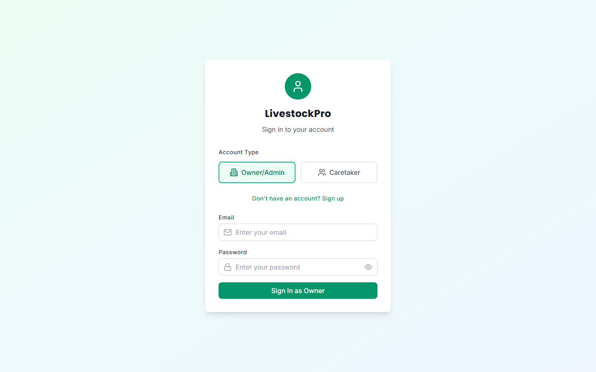

# LivestockPro 🐄

A full-stack livestock management platform for farm owners and caretakers — track animals, monitor health, manage finances, and identify livestock by QR code, all from the browser.

**[Live demo →](https://livestock-management.vercel.app)**



## The problem

Small and mid-size farms track animals, health events, breeding, and expenses across notebooks and memory. When an animal changes hands or a caretaker needs its history in the field, that information is slow to find and easy to lose. LivestockPro puts every animal's record — identity, health, lineage, and cost — behind a scannable QR tag and a role-based dashboard, so owners see the whole operation and caretakers see exactly what they need.

## Features

- **Role-based access** — separate Owner/Admin and Caretaker accounts with scoped permissions
- **Animal registry** — profiles with photos, categories, weight, and status tracking
- **QR code identification** — generate and scan QR tags to pull up an animal's full record in the field
- **Health monitoring** — log health events, treatments, and history per animal
- **Financial analytics** — track investments and expenses with interactive charts
- **PDF & report export** — generate printable records with jsPDF and html2canvas
- **Offline-tolerant data** — React Query with persisted cache keeps the app responsive on flaky farm connections
- **Multi-business support** — manage more than one farm/business under a single account
- **Dark mode** — theme-aware UI

## Tech stack

| Layer | Technology |
|---|---|
| Frontend | React, TypeScript, Vite, React Router |
| Styling | Tailwind CSS, Headless UI, Lucide icons |
| Data & auth | Supabase (PostgreSQL + auth) |
| Data fetching | TanStack React Query (with persisted cache) |
| Forms & validation | React Hook Form, Yup |
| Charts | Recharts |
| QR & PDF | qrcode, html5-qrcode, jsPDF, html2canvas |

## Getting started

### Prerequisites

- Node.js 18+
- A [Supabase](https://supabase.com) project

### Setup

```bash
git clone https://github.com/BaseerAhmedTahir/Livestock_Management.git
cd Livestock_Management
npm install
```

Create a `.env` file with your Supabase credentials:

```env
VITE_SUPABASE_URL=your-project-url
VITE_SUPABASE_ANON_KEY=your-anon-key
```

Then start the dev server:

```bash
npm run dev
```

## License

MIT
